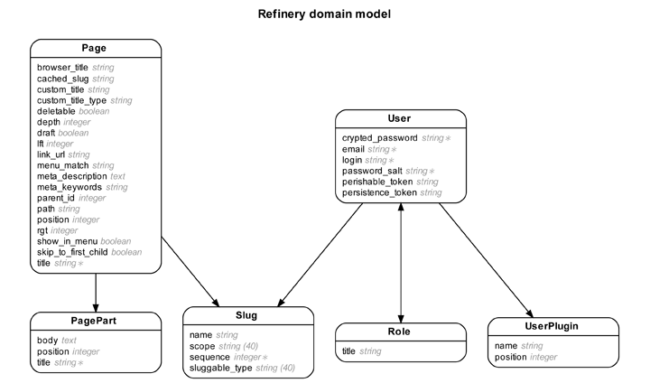

!SLIDE 
# Improve Your Rails Development Workflow

## [Rails Peru](http://rails.pe) meeting - March 26, 2011
## [Florent Guilleux](http://www.florentguilleux.fr)

!SLIDE
# Disclaimer: mastering your editor and shell are probably the most important things to do to improve your workflow
## But let's concentrate on tools for today...

!SLIDE bullets incremental
# 1. Speed-up application initial setup with a [Rails application template](http://railscasts.com/episodes/148-app-templates-in-rails-2-3)

* templates for Rails 3: [https://github.com/leshill/rails3-app](https://github.com/leshill/rails3-app)
* references: [Rails Generators Actions](http://github.com/rails/rails/blob/master/railties/lib/rails/generators/actions.rb) & 
[Thor Actions](http://rdoc.info/github/wycats/thor/master/Thor/Actions)

!SLIDE
# 2. Automate the launch of commands needed for your application with [Terminitor](https://github.com/achiu/terminitor)

!SLIDE code smaller

# config file example for a Rails project

    @@@ruby
    window do
      before do run "cd ~/projects/demo" end

      run "git st"
      run "mate ."

      tab :name => "server" do run "rails server" end
      
      tab :name => "console" do run "rails console" end

      tab :name => "spork" do run "bundle exec spork" end

      tab :name => "autotest" do run "bundle exec autotest" end
    end

!SLIDE bullets incremental
# 3. Make your application 10 times faster in development mode with [RailsDevelopmentBoost](https://github.com/thedarkone/rails-dev-boost) 

!SLIDE
# 4. Automatically refresh your browser when a file has changed with [AutoRefresh](https://github.com/logankoester/autorefresh)

!SLIDE bullets incremental
# 5. Improve your rails console with [Hirb](https://github.com/cldwalker/hirb) and [Wirble](http://pablotron.org/software/wirble/)

* For Rails 3, use [RichRC](https://github.com/miaout17/richrc)  
(it also displays SQL requests)

!SLIDE code small

    @@@ruby
    >> Post.all
      Post Load (0.7ms)  SELECT "posts".* FROM "posts"
      +-----+-------------------------+----------+
      | id  | created_at              | title    |
      +-----+-------------------------+----------+
      | 907 | 2009-03-06 21:10:41 UTC | hello    |
      | 906 | 2009-03-06 08:47:04 UTC | world    |
      +-----+-------------------------+----------+
      2 rows in set

!SLIDE bullets incremental
# 6. Easily know the attributes/columns of your models with [Annotate](https://github.com/ctran/annotate_models)
* and run it automatically when you migrate with [migrate-well](https://rubygems.org/gems/migrate-well) (shameless plug)

!SLIDE code smaller

# annotation of a LineTime model

    @@@ruby
    class LineItem < ActiveRecord::Base
      belongs_to :product
      # ...
    end
    
    # == Schema Info
    #
    # Table name: line_items
    #
    #  id                  :integer(11)    not null, primary key
    #  quantity            :integer(11)    not null
    #  product_id          :integer(11)    not null
    #  unit_price          :float
    #  order_id            :integer(11)
    #

!SLIDE
# 7. Generate diagrams of a Rails application with [Rails ERD](https://github.com/voormedia/rails-erd) or [RailRoady](http://railroady.prestonlee.com/)

!SLIDE center

!SLIDE
# 8. Open gem code quickly with [qwandry](https://github.com/adamsanderson/qwandry)

!SLIDE center
